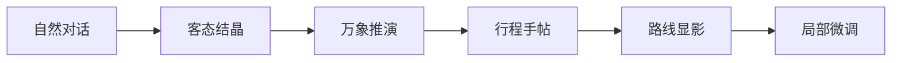

# 贵客万象 · 启境

> 一款以贵州山水、人文与非遗体验为内容底座的 AI 旅行共创产品。

[](https://github.com/yxthu27/gui_ke_wan_xiang/actions/workflows/deploy-pages.yml)
[](./LICENSE)

在线体验：[GitHub Pages](https://yxthu27.github.io/gui_ke_wan_xiang/) · 设计规范：[在线 `/spec`](https://yxthu27.github.io/gui_ke_wan_xiang/spec/)

**项目标签：#Guikesong**

贵客万象不是传统的景点清单工具，而是一套从“理解旅行者”开始的行程生成体验。用户通过与数字向导「阿境」完成六轮自然对话，逐步表达心愿、时间、步速、交通、兴趣和旅途边界；系统据此形成客态结晶，并生成可查看、可微调、可收藏的贵州旅行方案。

<p align="center">
  
</p>

## 产品定位

贵客万象面向希望深度体验贵州、但不想被复杂攻略和表格式问卷打断的旅行者。产品以“自由表达、边界优先、行程可解释”为核心原则：

- **先理解，再规划**：用连续对话代替一次性表单。
- **保护真正重要的内容**：心愿与旅途边界在生成和微调阶段保持锁定。
- **让推荐有理由**：行程不仅给出地点，也解释节奏、顺序与取舍。
- **连接在地体验**：把山水、村寨、非遗、饮食和城市生活组织成完整旅程。

## 核心体验

### 1. 启境 · AI 行程共创

「阿境」通过六轮对话建立旅行画像：

1. **心愿**：最多选择两个真正想遇见的场景。
2. **时间**：确认停留天数、抵达与离开位置。
3. **步速**：选择慢慢来、刚刚好或尽兴一点。
4. **走法**：设置交通方式、是否换住处和最长转场。
5. **风物**：收集非遗、饮食、摄影、村寨等兴趣。
6. **边界**：锁定同行人、体力、早起、拥挤等不可妥协条件。

六问结束后，系统会依次呈现：



### 2. 随逛 · 在地内容探索

以地图和内容卡片组织贵州本地体验，支持贵客视角与全局视角切换，并可将感兴趣的地点或活动纳入当前旅程。

### 3. 个人 · 旅行资产沉淀

承载个人行径、收藏、贵客帖与旅途内容，让一次规划可以继续被查看、整理和分享。

### 4. 广场 · 贵州体验社区

聚合旅行者发布的内容与在地灵感，形成可浏览、可发现、可回到个人空间的内容广场。

## 已实现能力

- 四栏产品外壳：路线、随逛、个人、广场。
- 13 个启境产品页面及完整页面流转。
- 六问选项、数量限制、输入校验和辅助文字输入。
- 心愿第三项自动替换、风物标签删除和明确的选择反馈。
- 客态结晶、行程结果、地图与微调页面共享真实用户答案。
- 节奏、转场、住处设置的局部微调。
- 基于 `sessionStorage` 的本机暂存与恢复。
- iframe 页面与主导航之间的双向消息桥。
- 随逛地图的显示/隐藏生命周期管理。
- 键盘焦点、按压反馈、ARIA 状态和触控区域优化。
- `/spec` 设计审阅工作台，保留完整页面规范与状态预览。

## 技术架构

| 层级 | 技术与职责 |
| --- | --- |
| 应用框架 | React 19、Next.js 16 API、Vinext、Vite 8 |
| 运行环境 | Cloudflare Worker 兼容 ESM 输出 |
| UI 与图标 | TypeScript、CSS、Lucide React、定制双态 Tab 图标 |
| 主产品流 | React Context + 本地状态驱动的启境页面状态机 |
| 历史模块整合 | 同源 iframe + `CustomEvent` / `postMessage` 桥接 |
| 本地持久化 | `sessionStorage`，用于对话草稿与行程暂存 |
| 地图能力 | Leaflet、GCoord（随逛模块） |
| 部署配置 | OpenAI Sites / Cloudflare 配置保留在 `.openai/hosting.json` |

## 运行模式

| 模式 | 页面能力 | AI 能力 | 适用场景 |
| --- | --- | --- | --- |
| 本地/服务端模式 | 完整 | 可接 StepFun 服务端密钥 | 开发与真实 AI 联调 |
| GitHub Pages 静态模式 | 完整 | 使用本地安心方案 | 产品演示与 UI 审阅 |
| Pages + 独立 API | 完整 | 调用外部 HTTPS 后端 | 正式部署方向 |

GitHub Pages 无法运行 `/api/qijing/*`，也不能安全保存 AI 密钥。正式启用 AI 时，应把接口部署到 Cloudflare Worker 或其他服务端环境，并通过公开的 `NEXT_PUBLIC_QIJING_API_BASE_URL` 指向该后端。

## 项目结构

```text
qijing-ui-merged/
├─ app/
│  ├─ page.tsx             # 四栏产品外壳、启境流程与 iframe 桥接
│  ├─ spec/page.tsx        # 启境页面组件、问答状态与设计工作台
│  ├─ globals.css          # 产品视觉系统与各页面样式
│  └─ merged.css           # 合并层、底部导航与产品流覆盖样式
├─ public/
│  ├─ assets/              # 阿境、背景与产品视觉资源
│  ├─ legacy/tab2/         # 随逛模块
│  ├─ legacy/tab34/        # 个人与广场模块
│  └─ tabbar-icons/        # 四栏导航黑白/彩色双态图标
├─ scripts/                # Sites 安装与构建脚本
├─ tests/                  # 构建及预览元数据验证
└─ .openai/hosting.json    # Sites 托管声明
```

## 本地开发

### 环境要求

- Node.js `>= 22.13.0`
- npm
- Bash（执行项目内 Sites 构建脚本时需要）

### 安装与启动

```bash
npm install
cp .env.example .env
npm run dev
```

在 `.env` 中配置阶跃星辰服务：

```env
STEPFUN_BASE_URL=https://api.stepfun.com/step_plan/v1
STEPFUN_API_KEY=你的服务端接口密钥
STEPFUN_CHAT_MODEL=step-3.7-flash
STEPFUN_TIMEOUT_MS=20000
STEPFUN_IMAGE_BASE_URL=https://api.stepfun.com/v1
STEPFUN_IMAGE_MODEL=step-image-edit-2
STEPFUN_IMAGE_TIMEOUT_MS=65000
```

密钥只会由服务端 API 路由读取，不应写入客户端代码或提交到 Git。未配置密钥时，六问解析和行程生成会自动使用本地降级逻辑，产品流程仍可完整运行。

### AI 服务接口

| 地址 | 作用 |
| --- | --- |
| `POST /api/qijing/chat` | 理解六问自由输入并生成安全的 `draftPatch` |
| `POST /api/qijing/plan` | 根据客态结晶生成结构化行程 |
| `POST /api/qijing/refine` | 在保护心愿与边界的前提下微调现有行程 |
| `POST /api/qijing/cutout` | 用 StepFun 图像编辑生成纯色背景蒙版，供个人页提取透明主体 |

### 个人页 AI 抠图

抠图采用可降级的混合链路：浏览器先把照片最长边压到 2048 像素，经服务端代理发送给 `step-image-edit-2`，要求模型保持主体不变并将背景替换成纯品红色；浏览器随后只从画布边缘提取品红连通域作为 Alpha 蒙版，并把蒙版应用回原始像素。这样可避免直接把生成模型改写后的主体当成最终照片。

当未配置 `STEPFUN_API_KEY`、模型超时或内容过滤时，前端会自动切换到现有 IMG.LY/ONNX 本地抠图；两条路径都失败时才使用中央裁切安全回退。启用 StepFun 路径意味着用户选择的照片会发送至阶跃星辰服务，产品上线前应在隐私说明中明确告知用户。

默认开发地址通常为：

```text
http://127.0.0.1:5173/
```

### 生产构建

```bash
npm run build
```

在未配置 Bash 的 Windows 环境中，可使用以下命令完成原生构建验证：

```powershell
npx vite build
```

### 部署到 GitHub Pages

GitHub Pages 只能托管静态文件，不能运行本项目的 `/api/qijing/*` 服务端路由，也不能安全保存 `STEPFUN_API_KEY`。仓库因此提供了独立的静态构建：

```bash
npm run build:pages
```

产物位于 `dist/client`，会自动适配项目站点路径 `/gui_ke_wan_xiang/`、生成 `.nojekyll` 与 `404.html`，并保留完整的本地安心行程和浏览器本地抠图能力。不要把 `STEPFUN_API_KEY` 添加到 GitHub Actions 或任何 `NEXT_PUBLIC_*` 变量中。

`.github/workflows/deploy-pages.yml` 会在 `main` 分支更新后自动构建并发布。首次启用时，在 GitHub 仓库的 **Settings → Pages → Build and deployment** 中将 Source 设为 **GitHub Actions**，也可以在 Actions 页面手动运行 `Deploy GitHub Pages`。

如需在 Pages 上启用真实 AI，需要把 API 路由单独部署到支持服务端运行和 Secret 的平台，并在仓库 **Settings → Secrets and variables → Actions → Variables** 中增加：

```text
QIJING_API_BASE_URL=https://你的后端域名
```

这里只能填写公开的后端基础地址。真实 AI 密钥必须保留在后端；后端还需要允许 `https://yxthu27.github.io` 发起 CORS 请求。不配置该变量时，Pages 会直接使用本地安心方案，不会等待一个必然返回 404 的接口。

## 页面入口

| 地址 | 用途 |
| --- | --- |
| `/` | 贵客万象完整产品体验 |
| `/spec` | 启境全页面设计审阅与开发规范 |

## 设计语言

产品视觉以贵州山地气质为线索，使用宣纸米白、山黛青与朱砂红建立层级；通过水墨质感、留白、双态图标和克制的动效，表达“山水展开、旅程被理解”的体验。交互设计强调明确的选择状态、可撤销操作和不依赖悬停的移动端触控反馈。

## 当前状态

当前仓库为可交互产品原型与前端工程版本。核心页面、四栏导航、状态流转、草稿恢复、AI 服务端接口和 GitHub Pages 静态构建已经具备；账户体系、云端持久化、正式地图数据、内容审核以及 ASR/TTS 仍需要独立后端。

静态安心方案用于服务降级和演示，不应替代真实旅行信息核验。地点营业状态、交通时间、天气等时效信息在正式产品中必须来自可靠数据源。

## 项目文档

- [真实数字人接入评估与实施计划](./docs/REAL_DIGITAL_HUMAN_INTEGRATION_PLAN.md)
- `/spec`：产品页面、交互状态和开发规则审阅入口。

数字人模型目前不在仓库中。任何 VRM 或其他角色资产在加入项目前，必须先确认公开托管、修改和再分发权限。

## 贡献说明

提交改动前建议完成：

```bash
npx vite build
git diff --check
```

请保持启境流程中的“心愿与边界不可被生成逻辑擅自覆盖”这一产品约束，并在新增视觉按钮时同步实现键盘、触控和反馈状态。

## 许可

项目原创源代码使用 [MIT License](./LICENSE)。第三方库、图片、字体、地图数据、用户内容、品牌素材和未来接入的数字人模型不因本仓库的 MIT License 自动获得授权，仍适用各自权利人与许可条款。

---

**贵客未行，万象先启。**
