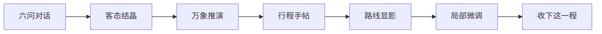
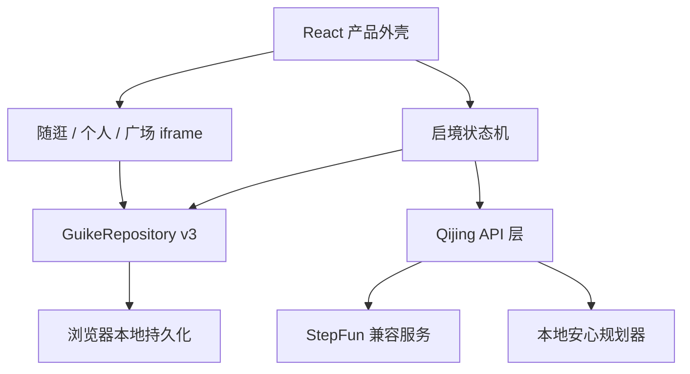

# 贵客万象 · 启境

> 贵客未行，万象先启。

[](https://github.com/yxthu27/gui_ke_wan_xiang/actions/workflows/deploy-pages.yml)
[](./LICENSE)

在线体验：[贵客万象](https://yxthu27.github.io/gui_ke_wan_xiang/) · 设计审阅：[页面规范 `/spec`](https://yxthu27.github.io/gui_ke_wan_xiang/spec/)

**项目标签：#Guikesong**

假如一个人第一次来到贵州，他真正需要的也许不是又一张“必去景点 Top 10”。

他可能只知道，自己想在山雾里慢一点，想吃一顿地道的酸汤，带着长辈，不愿赶早，也不希望每天换酒店。传统攻略要求他先理解目的地，再自己拼接交通、时间和体验；传统行程生成器则往往在几秒钟内给出一张看似完整、却没有真正理解他的表格。

「贵客万象」想从另一端开始：先认识这位旅行者，再替他展开贵州。

用户会遇见数字向导「阿境」。阿境一次只问一件事，从心愿、时间、步速、走法、风物一直聊到不可妥协的旅途边界。答案最终凝结成一份“客态结晶”，然后被推演为可查看、可解释、可微调，也能在服务不可用时安全降级的贵州行程。

<p align="center">
  
</p>

## 这不是一张景点清单

贵客万象是一套以贵州山水、人文、非遗与城市生活为内容底座的 AI 旅行共创体验。它面向那些想认真感受一处地方、却不愿先成为攻略专家的旅行者。

产品围绕四条原则展开：

- **先理解，再规划**：用连续对话替代一次性长表单，让需求在交流中逐渐清晰。
- **边界比推荐更重要**：心愿和不可妥协条件是受保护数据，生成与微调都不能擅自覆盖。
- **路线应该说得清理由**：不仅告诉用户去哪里，也解释为什么这样排序、哪里留白、做了什么取舍。
- **服务故障不应终止旅程**：AI、语音、地图或数字人能力不可用时，文字流程和本地安心方案仍然可完成闭环。

## 一位贵客如何走完整段旅程

### 第一章：与阿境聊六件事

体验从一张贵州来帖开始。用户收下帖子后，阿境不会立刻生成路线，而是依次了解六个维度：

1. **心愿**：这一程无论如何想遇见什么。可以是瀑布、村寨，也可以是一种画面或感受。
2. **时间**：停留几天，从哪里抵达，又从哪里离开。
3. **步速**：想慢慢来、刚刚好，还是尽兴一点。
4. **走法**：更习惯高铁、打车、自驾还是公共交通，能否换住处，最长能接受多久转场。
5. **风物**：什么会让他多停一会——地方小吃、非遗手作、摄影、茶园或夜市。
6. **边界**：哪些事情绝不能替他决定，例如带长辈、少走台阶、不赶早、不走夜路。

每一问都支持点选和自由输入。中文语音听写让用户可以直接说，阿境也可以重播问题；只有用户主动启用后，系统才会朗读回复。浏览器不支持语音或用户拒绝权限时，文字输入始终保留。

### 第二章：形成客态结晶

六问结束后，零散答案会被整理成一份旅行画像。这里不是结果页，而是生成前的最后一次共同确认：

- 心愿锚点被明确列出；
- 时间、节奏、住处和转场条件被结构化；
- 旅途边界被锁定；
- 用户可以返回修改，而不是被迫接受系统的理解。

### 第三章：让万象展开

确认之后，系统尝试调用 AI 生成结构化行程。成功时会标记为 AI 方案；密钥未配置、请求超时、供应商异常或返回内容不合规时，会立即切换到本地安心方案。

无论使用哪种生成来源，用户最终得到的都是同一套体验：



行程按天展示地点、时间、停留时长与推荐理由。微调只改变走法，不会悄悄删除被保护的心愿或越过用户边界。

### 第四章：离开规划页之后，数据仍然同行

贵客万象不把四个底部栏目当成四个互不相干的演示页。当前版本已经建立统一的设备本地数据仓库，并兼容迁移早期页面各自保存的数据：

- 在「路线」收下的行程，会出现在「个人」的今日行径与我的行径中；
- 在「随逛」收藏的地点，会进入个人收藏；
- 从随逛决定前往的地点，可以加入当前主路线；
- 在「广场」收藏的他人行径，会进入个人空间的他人行径；
- 贵客帖、万象内容、发布记录与到访状态可以在刷新后恢复；
- 同一页面内的重复写入会被去重，避免存储事件形成自触发更新循环。

这套持久化目前以浏览器 `localStorage` 为主，辅以会话草稿兼容，因此适合单设备演示与连续体验。它并不等同于账户云同步：清除浏览器数据、使用无痕窗口或更换设备后，数据不会自动迁移。

### 第五章：把自己的贵州带回个人空间

「个人」不是一个静态个人中心，而是旅途资产沉淀的地方：今日行径、走过的路线、收藏的地点、他人的路线和用户拾取的万象，都在这里重新汇合。

照片主体提取采用可降级的混合链路：有服务端 AI 时，先用图像编辑模型生成纯色背景，再在浏览器边缘提取连通区域形成透明蒙版；服务不可用时切换到浏览器本地模型，最后仍保留安全裁切回退。真实照片发送第三方服务前，正式产品必须提供清晰的隐私告知。

## 四个产品空间

| 空间 | 用户正在做什么 | 已形成的数据关系 |
| --- | --- | --- |
| 路线 | 与阿境完成六问、生成路线、查看地图、微调并收下行程 | 产生草稿、客态结晶和当前主路线 |
| 随逛 | 在地图附近发现地点、活动和在地内容 | 可收藏地点，也可把地点加入主路线 |
| 个人 | 查看今日行径、我的路线、收藏、万象与贵客帖 | 汇总路线、地点、内容和社区收藏 |
| 广场 | 浏览其他贵客如何遇见贵州 | 收藏或发布行径，并与个人空间同步 |

## 已实现能力

- 四栏产品外壳：路线、随逛、个人、广场。
- 13 个启境产品页面以及邀请、六问、结晶、推演、行程、地图和微调的完整流转。
- 点选、自由输入、数量约束、错误提示和可撤销选择。
- 中文 ASR 语音听写、问题重播、主动启用后的 TTS 回复朗读。
- AI 对话解析、结构化行程生成、受保护条件下的局部微调。
- AI 未配置、超时或异常时的本地安心方案。
- 统一版本化本地数据仓库、旧数据迁移、重复写入去重和刷新恢复。
- 路线、随逛、个人、广场之间的双向数据联动。
- 同源 iframe 生命周期管理以及 `CustomEvent` / `postMessage` 消息桥。
- 阿境海报模式、能力检测和数字人状态机基础。
- 键盘焦点、ARIA 状态、触控区域、按压反馈和移动端适配。
- `/spec` 页面设计审阅工作台。
- GitHub Pages 项目子路径构建和自动发布流程。

## AI、语音与数字人的真实边界

### AI 服务

AI 密钥只允许存在于服务端环境。前端通过以下接口与能力层交互：

| 接口 | 作用 | 失败时如何处理 |
| --- | --- | --- |
| `POST /api/qijing/chat` | 理解六问中的自然语言并返回安全的草稿补丁 | 使用本地语义规则继续填写 |
| `POST /api/qijing/plan` | 根据客态结晶生成结构化多日行程 | 生成完整的本地安心方案 |
| `POST /api/qijing/refine` | 在保护心愿与边界的前提下微调路线 | 仅执行能够可靠理解的本地调整 |
| `POST /api/qijing/cutout` | 为个人页照片生成纯色背景蒙版 | 回退到浏览器本地抠图或安全裁切 |
| `GET /api/qijing/health` | 告知前端当前配置和运行模式 | 不暴露密钥，也不伪装成真实连通性探测 |

健康接口回答的是“服务是否已配置”，不是“供应商此刻一定可达”。真实上线还需要独立的探活、日志、指标、超时、限流与告警。

### 浏览器语音

语音输入使用 Web Speech Recognition，朗读使用 Speech Synthesis。原始录音不会由本项目主动上传或保存。麦克风通常要求 HTTPS 或 `localhost`，Chrome 与 Edge 支持相对完整；Safari、Firefox、部分 WebView 或权限被拒绝时会显示可操作的原因，文字流程不受影响。

### 数字人

当前仓库默认运行**海报模式**：展示阿境形象、说话/聆听/思考等业务状态，但不加载真实 VRM。项目已经具备能力检测与渲染状态机基础，真实数字人仍需要完成：

- VRM 资产的公开托管、修改和再分发授权确认；
- Three.js / `@pixiv/three-vrm` 懒加载与低性能设备降级；
- TTS 音频驱动的口型、眨眼和待机动作；
- 模型体积、纹理压缩、首屏性能和移动端内存验证。

仓库外的 `avatar.vrm` 不会被构建脚本自动发布。`npm run build:pages` 会先执行资产策略检查，避免未经确认的模型进入公开产物。

## 技术架构



| 层级 | 技术与职责 |
| --- | --- |
| 应用框架 | React 19、Next.js 兼容 API、Vinext、Vite 8 |
| 运行输出 | Cloudflare Worker 兼容 ESM，以及 GitHub Pages 静态导出 |
| UI 系统 | TypeScript、CSS、Lucide React、定制双态底部导航 |
| 启境流程 | React 状态机、结构化草稿、受保护字段与本地规划器 |
| 历史模块整合 | 同源 iframe、`CustomEvent`、`postMessage` 与共享仓库 |
| 设备本地数据 | `GuikeRepository v3`、`localStorage`、旧键迁移与会话草稿兼容 |
| 地图能力 | Leaflet、GCoord，以及随逛模块的显隐生命周期管理 |
| 托管声明 | `.openai/hosting.json` 保留 Sites 项目标识；D1、R2 当前未启用 |

### 统一数据模型

共享仓库目前保存以下领域：

```text
draft                 六问草稿
activePlan            当前主路线及启境结构化方案
favoritePlaces        地点收藏
savedJourneys         收藏或保存的路线
wanxiangItems         用户拾取的万象内容
publishedJourneys     已发布的贵客帖/行径
stroll                随逛新增地点与到访状态
```

数据结构带有 `schemaVersion`、`revision`、`updatedAt` 和 `lastSection`，用于迁移、同步和控制刷新范围。当前版本是设备本地单一事实源；未来接入账户系统时，应由后端数据库承担权威状态，本地仓库转为缓存和离线队列。

## 项目结构

```text
qijing-ui-merged/
├─ app/
│  ├─ api/qijing/            # 对话、规划、微调、抠图与健康接口
│  ├─ components/avatar/     # 阿境海报、能力检测与状态机
│  ├─ lib/                   # AI、语音、规划器、公开路径和仓库适配
│  ├─ qijing-client.tsx      # 启境主流程和四栏产品协调
│  ├─ merged.css             # 产品流、导航与响应式覆盖样式
│  └─ spec/                  # 页面组件与设计审阅工作台
├─ public/
│  ├─ assets/                # 阿境、背景和产品视觉资源
│  ├─ legacy/shared/         # 四个产品空间共用的数据仓库
│  ├─ legacy/tab2/           # 随逛模块
│  ├─ legacy/tab34/          # 个人与广场模块
│  └─ tabbar-icons/          # 四栏导航黑白/彩色双态图标
├─ scripts/                  # 构建、GitHub Pages 与资产策略检查
├─ tests/                    # AI 降级、语音、数字人、仓库与构建测试
├─ docs/                     # 技术路线和数字人接入评估
└─ .openai/hosting.json      # Sites 托管声明
```

## 本地开始一段旅程

### 环境要求

- Node.js `>= 22.13.0`
- npm

### 安装与启动

```bash
npm install
cp .env.example .env
npm run dev
```

默认开发地址通常为：

```text
http://127.0.0.1:5173/
```

Windows PowerShell 可以这样复制环境文件：

```powershell
Copy-Item .env.example .env
npm run dev
```

不配置 AI 密钥也可以体验全部产品流程。此时系统会使用本地语义解析和安心行程，不会把“没有服务”表现成页面崩溃。

### 配置真实 AI

在本地 `.env` 或托管平台 Secret 中配置：

```env
STEPFUN_BASE_URL=https://api.stepfun.com/step_plan/v1
STEPFUN_API_KEY=你的服务端接口密钥
STEPFUN_CHAT_MODEL=step-3.7-flash
STEPFUN_TIMEOUT_MS=20000
STEPFUN_CHAT_TIMEOUT_MS=12000
STEPFUN_PLAN_TIMEOUT_MS=45000

STEPFUN_IMAGE_BASE_URL=https://api.stepfun.com/v1
STEPFUN_IMAGE_MODEL=step-image-edit-2
STEPFUN_IMAGE_TIMEOUT_MS=65000
```

不要把真实密钥写入 `NEXT_PUBLIC_*`、客户端代码、README、GitHub Pages 构建变量或 Git 历史。

## 验证与测试

运行完整构建和自动化测试：

```bash
npm test
```

当前测试覆盖：

- 多日安心行程的完整性和抵达/离开约束；
- 心愿与旅途边界的保护规则；
- 中文语音转写合并与权限错误提示；
- 数字人状态机与公开资产策略；
- 统一仓库迁移、跨模块接入和重复写入去重；
- 关键页面构建与预览元数据。

提交前建议额外检查：

```bash
git diff --check
npm run build:pages
```

## 部署到 GitHub Pages

GitHub Pages 只能托管静态文件，不能执行 `/api/qijing/*`，也不能安全保存 `STEPFUN_API_KEY`。因此仓库提供独立静态构建：

```bash
npm run build:pages
```

产物位于 `dist/client`。脚本会自动：

- 适配项目路径 `/gui_ke_wan_xiang/`；
- 生成 `.nojekyll` 与 SPA 回退用的 `404.html`；
- 校验数字人资产没有被意外公开；
- 保留本地安心方案、浏览器语音和本机数据闭环。

`.github/workflows/deploy-pages.yml` 会在 `main` 更新后自动构建并发布。首次启用时，请在仓库 **Settings → Pages → Build and deployment** 中把 Source 设为 **GitHub Actions**。

### 让 Pages 使用真实 AI

真实 AI 必须部署在 Cloudflare Worker 或其他能够保存 Secret、运行服务端代码的平台，然后在 GitHub 仓库 **Settings → Secrets and variables → Actions → Variables** 中增加公开变量：

```text
QIJING_API_BASE_URL=https://你的后端域名
```

这只是公开的 API 基础地址，不是密钥。后端需要允许 `https://yxthu27.github.io` 发起 CORS 请求。未配置时，Pages 会直接使用本地安心方案，不会等待注定不存在的静态 API。

## 其他运行方式

| 模式 | 页面能力 | AI 能力 | 数据能力 | 适用场景 |
| --- | --- | --- | --- | --- |
| 本地开发 | 完整 | 服务端 StepFun 或本地降级 | 设备本地 | 开发、设计评审、AI 联调 |
| GitHub Pages | 完整静态体验 | 本地安心方案 | 设备本地 | 公开演示、移动端体验 |
| Pages + 独立 API | 完整 | 真实 AI + 本地降级 | 仍为设备本地 | 小规模公开试用 |
| 完整产品后端 | 完整 | 真实 AI、观测与限流 | 账户、云同步、媒体存储 | 正式产品方向 |

## 当前边界与下一程

当前仓库已经是一套能完整走通、能在 AI 故障时继续工作、四个页面之间能够共享数据的交互产品。但它仍然是一段“可公开体验的产品原型”，不是已经完成生产治理的在线旅行服务。

正式上线前仍需完成：

- 账户、授权、数据删除和多设备同步；
- D1/PostgreSQL 等云端数据库以及 R2/对象存储；
- 真实 POI、营业时间、交通、天气和价格数据源；
- AI 请求追踪、质量评估、限流、成本控制与供应商探活；
- 社区发布审核、举报、隐私和内容权限；
- 真实 VRM 渲染、口型同步、性能分级与资产授权；
- 照片、语音和第三方 AI 数据处理的完整隐私政策。

静态安心方案用于服务降级和演示，不应替代真实旅行信息核验。地点营业状态、路况、交通时间和天气等时效信息，在正式产品中必须标明可靠来源与核验时间。

## 页面与文档入口

| 入口 | 内容 |
| --- | --- |
| `/` | 贵客万象完整产品体验 |
| `/spec` | 启境页面、交互状态和设计规范审阅 |
| [`docs/TECHNICAL_IMPLEMENTATION_ROADMAP.md`](./docs/TECHNICAL_IMPLEMENTATION_ROADMAP.md) | 从当前原型走向正式产品的技术路线 |
| [`docs/REAL_DIGITAL_HUMAN_INTEGRATION_PLAN.md`](./docs/REAL_DIGITAL_HUMAN_INTEGRATION_PLAN.md) | 真实数字人接入评估与实施计划 |

## 设计语言

产品视觉从贵州山地、宣纸与印章中取意，用宣纸米白、山黛青与朱砂红建立层级。水墨质感和大面积留白负责营造“山水徐徐展开”的呼吸，双态图标、明确的选中状态和克制动效负责告诉用户“系统确实记住了你刚才的选择”。

交互不依赖桌面悬停：主要动作具备足够触控面积、键盘焦点、ARIA 状态和按压反馈。视觉叙事可以含蓄，但操作结果必须明确。

## 贡献约定

任何改动都应保留一条最重要的产品约束：**生成逻辑不能擅自覆盖用户的心愿与旅途边界。**

新增功能时请同时考虑：

- AI 不可用时，用户能否继续；
- 刷新或切换栏目后，数据是否仍在；
- 键盘、触控和读屏用户是否获得同样明确的状态；
- 新资产是否具有公开托管和再分发权限；
- 新数据是否应留在设备本地，还是必须进入受治理的后端。

## 许可

项目原创源代码使用 [MIT License](./LICENSE)。第三方库、图片、字体、地图数据、用户内容、品牌素材以及未来接入的数字人模型，不因本仓库使用 MIT License 自动获得授权，仍适用各自权利人与许可条款。

---

**贵州不会因为一张路线表被看见。它会在一个人被认真理解之后，慢慢展开。**
