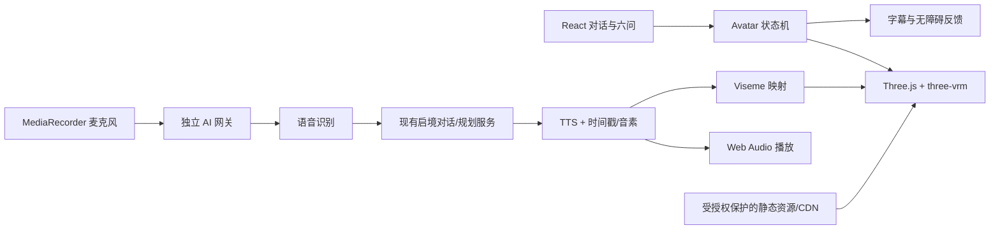

# “阿境”真实数字人接入评估与实施计划

> 文档状态：待评审
>
> 评估对象：`avatar.vrm`（本地评估文件，未纳入仓库）
>
> 目标项目：启境 / 贵客万象 Web H5
>
> 目标部署：GitHub Pages 前端 + 独立 AI/语音后端

## 1. 结论摘要

这个模型在技术结构上可用，适合接成浏览器内实时 3D 数字人，但当前不能直接作为公开站点资源上线。

### Go / No-Go 判断

| 维度 | 结论 | 说明 |
| --- | --- | --- |
| VRM 文件完整性 | Go | 文件头、声明长度和实际长度一致，是有效的 GLB 2.0 / VRM 1.0 文件 |
| 人形驱动 | Go | 具备 53 个人形骨骼，可驱动头、眼、躯干、手脚 |
| 表情与口型 | Go | 具备眨眼、情绪和 `aa / ee / ih / oh / ou` 五元音表达，可实现基础口型同步 |
| 视线与物理 | Go with optimization | 具备 LookAt 和 SpringBone，但弹簧骨骼规模较大，需要移动端性能治理 |
| 预制动画 | No-Go until added | 文件内没有 Animation Clip；待机、说话手势需要程序化生成或外接动画 |
| 首屏性能 | No-Go as-is | 原文件约 71.8 MB（68.5 MiB），不能直接进入移动端首屏关键链路 |
| 公开部署授权 | Blocked | 元数据为仅作者使用、个人非营利、禁止修改、禁止再分发，且作者和模型名为 `undefined` |
| GitHub Pages AI 能力 | External backend required | Pages 只能托管静态前端，AI、ASR、TTS、密钥与签名必须在独立后端 |

**推荐决策：有条件采用此 VRM。先解决授权和资产优化，再开发渲染与语音链路。**

## 2. 模型检查结果

### 2.1 文件与标准

- 文件大小：71,834,284 bytes，约 71.8 MB。
- 容器：glTF Binary 2.0。
- VRM 规范：VRM 1.0。
- 导出器：VRM Add-on for Blender v4.1.0。
- 扩展：`VRMC_vrm`、`VRMC_springBone`。
- 文件声明长度与实际长度完全一致，未发现截断。

### 2.2 模型能力

- 642 个节点、1 个 Mesh、16 个材质、16 个 Primitive。
- Primitive 顶点计数合计约 60,103。
- 6 张内嵌 PNG 纹理，纹理数据约 12.8 MB。
- 1 套 Skin，53 个人形骨骼。
- 18 个 VRM 预设表情：
  - 五元音：`aa`、`ee`、`ih`、`oh`、`ou`；
  - 眨眼：`blink`、`blinkLeft`、`blinkRight`；
  - 视线：`lookUp`、`lookDown`、`lookLeft`、`lookRight`；
  - 情绪：`happy`、`angry`、`sad`、`relaxed`、`surprised`、`neutral`。
- LookAt 类型为 Expression，可进行视线跟随。
- SpringBone：85 条 Spring、417 个 Joint、27 个 Collider；这会是低端手机的重点性能风险。
- 0 个预制动画，因此模型不会自行待机、挥手或说话。

### 2.3 授权阻塞项

模型当前 VRM Meta 为：

- `avatarPermission: onlyAuthor`
- `commercialUsage: personalNonProfit`
- `allowRedistribution: false`
- `modification: prohibited`
- `creditNotation: required`
- `authors: ["undefined"]`
- `name: "undefined"`

将 VRM 放入公开 GitHub 仓库、Pages 静态目录或公共 CDN，会让访问者能够下载文件，通常属于再分发。除非项目方确实是模型作者且已取得覆盖公开托管、项目用途和必要优化处理的权利，否则当前状态不能上线。

上线前必须完成以下任一项：

1. 取得作者书面授权，明确允许本项目用途、公开托管、必要的压缩和格式优化；
2. 由作者重新导出 VRM，并正确填写名称、作者、用途、商业使用、修改和再分发许可；
3. 更换为拥有完整项目授权的模型。

授权未确认前，不把原始 VRM 复制到仓库、`public/`、构建产物或任何公共 CDN。

## 3. 推荐产品形态

第一阶段不追求“真人视频克隆”，采用与现有阿境形象一致的实时 3D 向导：

- 阿境始终在对话舞台内，以 WebGL 实时渲染；
- 闲置时呼吸、眨眼、轻微视线移动；
- 用户讲话时进入聆听状态；
- AI 思考时显示明确的等待状态，而不是继续假装说话；
- TTS 播放时同步五元音口型、眨眼、视线和少量头部动作；
- 字幕始终可见，静音、低性能或 WebGL 失败时仍能完成六问；
- 不让数字人渲染阻塞路线规划、输入框和核心导航。

## 4. 技术架构



### 4.1 前端渲染层

建议使用：

- `three`
- `@pixiv/three-vrm`
- 原生 React Client Component + `useEffect` 管理渲染生命周期

第一版不引入 React Three Fiber，避免额外抽象和包体；当前场景只有单模型、固定相机和少量灯光，直接管理 Three.js 更容易控制加载、销毁、降级和性能。

新增建议目录：

```text
app/components/avatar/
  AjingAvatarStage.tsx
  useVrmAvatar.ts
  avatar-state-machine.ts
  lip-sync.ts
  animation-controller.ts
  capability-check.ts
  types.ts
```

`AjingAvatarStage` 只接受业务状态，不直接调用 AI：

```ts
type AvatarState =
  | "loading"
  | "idle"
  | "listening"
  | "thinking"
  | "speaking"
  | "error";
```

这样可以让 AI、TTS 和模型渲染各自失败、各自降级，避免形成一个无法测试的大组件。

### 4.2 动画层

由于模型没有动画 Clip，第一版采用程序化动画：

- Idle：胸腔轻微呼吸、头部低幅摆动、随机眨眼；
- Listening：身体略前倾、视线朝向用户、降低随机动作频率；
- Thinking：视线轻微偏移，保留字幕和加载反馈；
- Speaking：头部和上身低幅节奏动作，叠加口型；
- Reduced Motion：仅保留必要的表情变化，关闭位移和 SpringBone。

第二版再按需要引入 VRMA 或经过授权的动作数据，例如挥手、指引和欢迎动作。

### 4.3 口型同步

优先级从高到低：

1. **TTS 返回音素/Viseme 时间戳**：准确映射到五元音表达；
2. **TTS 返回字词时间戳**：按拼音韵母近似映射；
3. **只有音频**：Web Audio Analyser 驱动嘴部开合，并用规则生成近似元音；
4. **静音或失败**：字幕正常播放，嘴部回到 Neutral。

口型控制器每帧对表达权重做平滑插值，避免表情突跳；眨眼和情绪表达需要与口型分层混合，不能互相覆盖。

### 4.4 语音输入与输出

推荐正式链路：

- 浏览器用 `MediaRecorder` 录制；
- 音频上传到独立后端做 ASR；
- ASR 文本进入现有 `/api/qijing/chat`；
- AI 回复文本送入 TTS；
- 前端流式播放音频并驱动口型。

浏览器原生 SpeechRecognition 只作为可选增强，不作为唯一方案，因为不同浏览器支持和隐私行为不一致。

后端必须提供：

- 用户授权后才开始录音；
- 录音中、上传中、识别中状态；
- 取消和超时；
- 音频保留策略；
- 单次请求大小和频率限制；
- AI/ASR/TTS 分项健康检查；
- 不把任何服务密钥发往浏览器。

## 5. GitHub Pages 部署策略

GitHub Pages 只负责：

- React/JS/CSS/WASM 等静态前端；
- 数字人状态机、Three.js 渲染和本地降级；
- 调用外部 HTTPS API。

GitHub Pages 不负责：

- AI 密钥；
- ASR/TTS 签名；
- 用户音频持久化；
- 服务端流式代理；
- 权限与用量控制。

建议生产拓扑：

```text
GitHub Pages
  ├─ 页面与数字人运行时
  ├─ 小型 poster / fallback 图片
  └─ 调用 https://api.example.com

独立 API（Cloudflare Worker/其他服务端）
  ├─ /health
  ├─ /api/qijing/chat
  ├─ /api/qijing/plan
  ├─ /api/speech/asr
  └─ /api/speech/tts

模型资源
  └─ 经授权的对象存储/CDN，支持缓存、版本号和跨域
```

原始 71.8 MB 模型不建议随首页 JS 一起加载。数字人应在用户进入“开始聊六问”后再预加载，并提供海报图占位。

## 6. 资产优化计划

此阶段必须在获得“允许修改”的授权后进行。

### 目标预算

| 指标 | 当前 | 第一版目标 |
| --- | ---: | ---: |
| VRM 下载体积 | 71.8 MB | 15–25 MB；移动网络理想目标低于 15 MB |
| 首屏模型请求 | 立即加载则过重 | 用户进入对话后懒加载 |
| 材质 | 16 | 保持效果前提下合并或减少 |
| Spring Joint | 417 | 按发型、服装重要性分级，低端设备关闭或大幅降低 |
| 动画 Clip | 0 | 第一版程序化；第二版补 VRMA |

### 优化措施

1. 检查 6 张纹理实际尺寸，移动端降低不必要分辨率；
2. 在确认加载链兼容后使用 KTX2/Basis 纹理；
3. 清理不可见网格、重复顶点和无用 Morph 数据；
4. 对骨骼和 SpringBone 做质量档位：High / Balanced / Static；
5. 模型与纹理设置内容哈希，使用长期缓存；
6. 保留一个 WebP/AVIF 静态海报作为加载和失败降级；
7. 优化后重新执行 VRM 结构、表情、骨骼和授权元数据校验。

不应为了体积盲目使用 Draco。必须先验证 Morph Target、Skin、VRM 扩展和目标浏览器解码路径完整，再决定几何压缩方式。

## 7. 分阶段实施计划

### Phase 0：授权与视觉验收（0.5–1 天）

交付物：

- 模型授权确认记录；
- 正确的 VRM Meta；
- 桌面与手机渲染截图；
- 面部、骨骼、穿模、材质和视线检查表。

验收：

- 明确允许本项目公开托管及必要优化；
- 作者、模型名称和许可字段不再是 `undefined`；
- 确认人物确实是产品希望使用的“阿境”。

### Phase 1：渲染 Spike（1–2 天）

工作项：

- 安装 `three` 与 `@pixiv/three-vrm`；
- 建立独立的 `/avatar-lab` 开发页；
- 完成加载进度、相机、灯光、ResizeObserver 和资源销毁；
- 验证 18 个表达、53 个骨骼、LookAt 和 SpringBone；
- 建立 WebGL 失败和低性能静态图降级。

验收：

- Chrome、Edge、Safari 移动端目标设备可以完成加载；
- 离开页面后 Renderer、Texture、Geometry、AnimationFrame 全部释放；
- 表情面板可逐项验证五元音、眨眼和情绪；
- 不影响现有六问表单和导航。

### Phase 2：状态机与基础表演（1–2 天）

工作项：

- 接入 `loading / idle / listening / thinking / speaking / error`；
- 实现呼吸、眨眼、视线和头部程序化动作；
- 支持 `prefers-reduced-motion`；
- 把现有 `ajing-guide.png` 改成模型加载前/失败后的 Poster。

验收：

- UI 状态与真实 AI 状态一致；
- AI 未返回时不显示“阿境正在说”；
- 状态切换没有表情卡死和动作突跳。

### Phase 3：TTS 与口型（2–3 天）

工作项：

- 建立服务端 TTS 代理；
- 实现音频播放队列、取消和重复播放；
- 实现 Viseme/时间戳到五元音表达映射；
- 字幕与音频同步；
- 无时间戳时接入音频能量降级口型。

验收：

- “再说一遍”播放真实音频；
- 停止、跳页、开始新回复时旧音频和旧口型立即取消；
- 音频失败不阻塞用户继续回答；
- 字幕在静音状态下完整可用。

### Phase 4：ASR 与完整对话（2–3 天）

工作项：

- 麦克风授权、录音、取消和上传；
- ASR → 对话理解 → TTS 闭环；
- 与六问草稿、边界确认和保存逻辑对齐；
- 网络错误、权限拒绝、超时和服务降级。

验收：

- 用户说出的原文可确认、修改并保存；
- ASR 不确定时请求确认，不直接修改关键旅行约束；
- 权限拒绝后自动回到文字输入；
- AI、ASR、TTS 各自失败时有真实且不同的状态反馈。

### Phase 5：性能优化与灰度上线（2–4 天）

工作项：

- 模型与纹理压缩；
- 低端机能力探测和质量分级；
- CDN、缓存、CORS 与版本回滚；
- 性能埋点、崩溃监控、AI/语音健康检查；
- 10% → 50% → 100% 灰度。

验收：

- 数字人失败不影响六问完成率；
- 页面交互期间不出现长时间主线程冻结；
- 中端手机持续说话时帧率和温升可接受；
- 模型、Poster 与前端版本能够独立回滚。

## 8. 测试矩阵

### 功能

- VRM 加载成功、进度、取消、超时、404、跨域错误；
- Idle / Listening / Thinking / Speaking / Error 状态；
- 五元音、眨眼、情绪、LookAt、SpringBone；
- TTS 首次播放、重播、打断、切页和连续回复；
- 麦克风允许、拒绝、撤销、无输入和噪声；
- AI/ASR/TTS 独立降级；
- 字幕与文字输入始终可用。

### 设备

- 360×800、390×844、430×932；
- Android Chrome 中端机；
- iPhone Safari；
- Windows Chrome / Edge；
- WebGL2 不可用、低内存、弱网和省电模式。

### 性能

- 模型下载、解析、首次可见、首次可交互时间；
- 峰值内存、平均 FPS、长任务和 WebGL Context Lost；
- 页面切换后 GPU/内存是否释放；
- TTS 首包时间、整段耗时和口型延迟。

## 9. 风险与应对

| 风险 | 影响 | 应对 |
| --- | --- | --- |
| 授权不允许公开托管 | 无法上线 | 在任何集成开发前完成权利确认或换模型 |
| 71.8 MB 模型导致高流失 | 对话入口白屏或等待过长 | 懒加载、Poster、纹理/模型优化、CDN |
| 417 个 Spring Joint 消耗过高 | 手机掉帧、发热 | 质量分级，低端机关闭二级物理 |
| 没有动画 Clip | 人物僵硬 | 先程序化 Idle，后续引入 VRMA |
| TTS 无 Viseme | 口型不准确 | 时间戳映射；无时间戳使用能量降级 |
| Pages 无后端 | 密钥泄露、语音不可用 | 独立 API 网关，不在前端保存密钥 |
| WebGL 或权限失败 | 用户无法继续 | Poster、字幕和文字输入必须保持完整 |
| 数字人抢占注意力 | 六问效率下降 | 动作低幅、字幕优先、支持静音/关闭 |

## 10. 推荐排期与评审门

完整可用版本预计 8–15 个开发日，取决于授权、TTS/ASR 供应商能力以及模型优化幅度。

建议设置三个评审门：

1. **Gate A — 授权与角色确认**：未通过，不复制和发布模型；
2. **Gate B — 渲染与性能 Spike**：未达到移动端预算，继续优化或改用轻量模型；
3. **Gate C — 语音闭环**：ASR、AI、TTS、字幕、口型和降级全部可验证后才进入正式入口。

### 推荐的下一步

先执行 Phase 0，并由模型权利方重新导出一份元数据正确、允许本项目公开托管和优化的 VRM。授权通过后，再创建 `/avatar-lab` 完成 Phase 1；不要直接在当前六问页面上边开发边验证，以免把渲染风险带进主流程。
