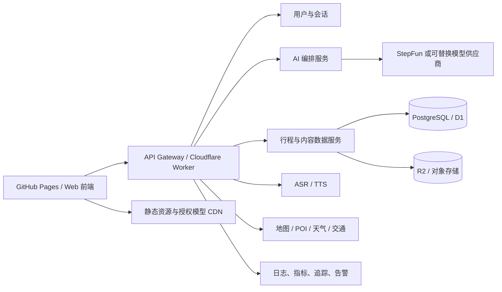

# 贵客万象技术实现路线（评审稿）

> 文档状态：待评审
> 更新时间：2026-08-30
> 适用范围：启境六问、AI 行程生成、随逛、个人、广场、数字人及生产部署

## 1. 建设目标

把当前可交互原型升级为可公开试用、可观测、可持续迭代的产品。第一阶段优先保证“六问—客态结晶—行程生成—微调—收藏”的闭环稳定；数字人、社区和实时数据在闭环稳定后分层接入，不能阻塞核心旅行规划。

核心原则：

1. 心愿和旅途边界是受保护数据，AI 只能补全和排序，不能擅自覆盖。
2. AI、语音、数字人、地图任一服务失败时，文字流程仍可完成。
3. 浏览器只持有公开配置，供应商密钥全部保存在服务端。
4. GitHub Pages 只承担静态前端；正式 AI、数据和用户能力由独立后端提供。
5. 所有生成结果必须结构化校验、标记来源，并提供可解释的降级方案。

## 2. 当前基础与主要缺口

### 已具备

- React 19、TypeScript、Vite 8、Vinext 页面工程。
- 路线、随逛、个人、广场四栏产品外壳。
- 六问状态机、客态结晶、行程展示、路线显影与局部微调。
- `/api/qijing/chat`、`plan`、`refine`、`cutout`、`health` 服务端接口。
- StepFun 接入和本地安心方案降级。
- `sessionStorage` 草稿恢复。
- GitHub Pages 静态构建、子路径处理和 Actions 发布流程。
- 数字人 Poster、能力检测、状态机雏形及 VRM 接入评估。

### 上线前缺口

- 无正式账户、云端数据持久化和多设备同步。
- 健康检查只能确认配置，尚未验证供应商真实连通性。
- 地点、交通、天气、营业状态仍缺少可信实时数据源。
- AI 输出缺少完整的质量评估、重试、限流、成本与追踪体系。
- ASR、TTS、口型同步和真实 VRM 渲染尚未形成闭环。
- 社区内容缺少发布审核、举报、隐私和权限控制。
- 自动化测试以构建验证为主，关键用户流 E2E 覆盖不足。

## 3. 目标架构



### 前端职责

- 页面渲染、表单约束、六问状态机、字幕与无障碍。
- 本地草稿、请求取消、超时提示和离线/降级体验。
- 只消费经过后端校验的结构化结果。
- 数字人按能力懒加载，并与业务状态解耦。

### 后端职责

- 保存密钥、鉴权、限流、幂等、审计和供应商适配。
- 拼装提示词、调用 AI、校验结果、执行保护规则和降级。
- 统一访问 POI、天气、交通、语音等外部服务。
- 保存用户、草稿、路线、收藏、帖子与媒体元数据。

## 4. 核心技术方案

### 4.1 前端状态与模块拆分

将当前集中式页面逻辑逐步拆为五个领域模块：

```text
app/
  features/onboarding/     # 六问与客态结晶
  features/planner/        # 生成、路线显影、微调
  features/discovery/      # 随逛与地图
  features/profile/        # 个人、收藏、贵客帖
  features/community/      # 广场与详情
  components/avatar/       # 数字人渲染与状态机
  lib/api/                 # API Client、错误映射、重试与取消
  lib/domain/              # Zod Schema、领域规则、共享类型
```

状态分三层：

- 页面瞬时状态：组件内部管理。
- 当前旅行草稿：统一 Store 管理，并版本化写入 `sessionStorage`。
- 用户长期数据：登录后写入后端，前端采用乐观更新与失败回滚。

草稿增加 `schemaVersion`、`updatedAt`、`requestId`，为数据迁移、幂等和问题追踪提供基础。

### 4.2 AI 编排

继续沿用现有三个核心接口，但统一请求信封和错误语义：

```ts
type ApiRequest<T> = {
  requestId: string;
  schemaVersion: number;
  payload: T;
};

type ApiResponse<T> = {
  requestId: string;
  source: "ai" | "fallback";
  data: T;
  warnings: string[];
};
```

处理链路：

1. 使用 Zod 校验输入并限制文本长度、数组数量和枚举范围。
2. 规范化客态数据，生成 `protectedWishes` 与 `protectedBoundaries`。
3. 调用模型，要求只返回 JSON。
4. 校验输出结构、天数、时间顺序、转场上限和保护字段。
5. 校验失败时只重试一次；仍失败则返回本地安心方案。
6. 响应标明 `source` 和 `warnings`，前端明确展示是否为降级结果。

供应商调用放在适配器后面：

```text
PlannerService
  ├─ StepFunProvider
  ├─ FutureProvider
  └─ LocalFallbackProvider
```

这样可以独立替换模型、做灰度和比较质量，不让业务代码依赖某一家 SDK。

### 4.3 旅行数据可信化

AI 负责“组织与解释”，事实数据由工具服务提供：

- POI：名称、坐标、地址、开放时间、联系方式和来源时间。
- 路线：真实距离、预计时长、交通方式和换乘信息。
- 天气：按旅行日期与地区查询。
- 风险：闭园、极端天气、超长转场、无障碍和儿童/长辈限制。

每个行程地点增加 `poiId`、`coordinates`、`verifiedAt`、`dataSource`。不能确认的信息显示“请出发前复核”，不得用 AI 生成内容冒充实时事实。

### 4.4 数据与账户

MVP 推荐使用 Cloudflare Worker + D1；如果预计快速扩展复杂搜索、推荐和运营后台，则直接使用托管 PostgreSQL。

最小数据模型：

| 实体 | 关键字段 |
| --- | --- |
| User | id、displayName、avatarUrl、createdAt |
| JourneyDraft | id、userId、schemaVersion、draftJson、updatedAt |
| JourneyPlan | id、userId、draftId、planJson、source、version、createdAt |
| Favorite | userId、targetType、targetId、createdAt |
| Post | id、userId、journeyId、content、visibility、reviewStatus |
| Media | id、ownerId、objectKey、mimeType、size、reviewStatus |

登录优先采用 OAuth/OIDC，不自行保存密码。游客可完整体验规划，登录只在跨设备保存、发布和收藏时出现，降低首用门槛。

### 4.5 数字人

第一版采用 Three.js + `@pixiv/three-vrm`，不让数字人直接访问 AI。

业务层只向数字人发送状态：

```text
loading → idle → listening → thinking → speaking → idle
                     └──────── error / poster fallback
```

实施顺序：

1. 解决 VRM 的公开托管、修改和再分发授权。
2. 把约 71.8 MB 模型优化到 15–25 MB，生成 Poster 降级图。
3. 接入 Idle、眨眼、视线与程序化说话动作。
4. 接入 TTS 音频；优先使用音素/Viseme 时间戳驱动五元音口型。
5. 接入 `MediaRecorder` + 服务端 ASR，浏览器原生识别仅作为增强。
6. 按设备提供 High、Balanced、Poster 三档质量。

必须保留字幕、键盘输入、静音和 `prefers-reduced-motion` 支持。WebGL、模型或语音失败均回退 Poster，不影响六问。

### 4.6 个人与广场

- 贵客帖图片先在浏览器生成预览，再上传对象存储。
- 上传前检查 MIME、尺寸、体积和 EXIF；默认移除定位信息。
- 发布状态使用 `draft → pending_review → published/rejected`。
- 广场接口采用游标分页，支持标签、地区和时间过滤。
- 举报、屏蔽、删除、权限校验和审核日志必须在开放发布前完成。

## 5. 部署路线

### 演示环境

- GitHub Pages：静态页面、Poster、本地安心方案。
- 每次合并到 `main` 自动执行 `npm run build:pages` 并发布。
- 禁止任何 API Key 进入 `NEXT_PUBLIC_*`、Actions 日志或静态产物。

### 试运行与生产环境

- 前端仍可使用 GitHub Pages，也可迁移到 Cloudflare Pages/Sites。
- API 使用 Cloudflare Worker，Secret 保存在平台环境变量。
- D1/PostgreSQL 保存结构化数据，R2 保存图片、音频和经授权的模型。
- 配置独立域名 `api.example.com`，仅允许正式前端域名 CORS。
- 开发、预发布、生产使用不同密钥、数据库和对象存储桶。

发布流程：

```text
Pull Request
  → lint + typecheck + unit test
  → build + static asset verification
  → E2E smoke test
  → preview deployment
  → manual approval
  → production deployment
  → synthetic health check
```

## 6. 安全、隐私与可观测性

### 安全与隐私

- API 限流：按 IP、会话和用户分层。
- 所有写接口使用鉴权、CSRF/Origin 校验和幂等键。
- 用户输入进入日志前脱敏；不得记录完整音频、密钥或原始照片。
- 明确告知照片和语音是否发送至第三方，提供取消与删除机制。
- 上传文件使用白名单、病毒扫描、签名 URL 和生命周期清理。
- AI 输出经过内容安全检查，社区内容经过审核。

### 可观测性

每个请求生成 `requestId`，串联前端、网关、AI 与数据服务。至少记录：

- 接口成功率、P50/P95 延迟和超时率。
- AI/Fallback 使用比例、Schema 校验失败率、重试率。
- 单次生成 Token/金额估算。
- 六问完成率、生成成功率、微调成功率和保存率。
- WebGL/VRM 加载失败率、首帧时间、TTS 首包时间。

告警门槛建议：五分钟窗口内核心 API 成功率低于 98%，或 P95 超过 8 秒时告警；AI 不可用时自动切换降级并在界面明确提示。

## 7. 测试策略

| 层级 | 覆盖内容 |
| --- | --- |
| 单元测试 | 草稿约束、心愿替换、边界保护、行程校验、微调规则 |
| 契约测试 | chat/plan/refine/health 的请求响应和错误码 |
| 组件测试 | 六问选择、输入校验、加载/错误/降级状态 |
| E2E | 游客完整六问、生成、微调、暂存恢复、四栏导航 |
| 可访问性 | 键盘、焦点、ARIA、对比度、Reduced Motion、字幕 |
| 性能 | 首屏、弱网、低端手机、数字人三档降级 |
| 安全 | 越权、上传、限流、提示注入、敏感信息泄漏 |

关键 E2E 使用固定数据和 Mock Provider；另设小规模真实供应商冒烟测试，避免 CI 因外部模型波动而不稳定。

## 8. 分阶段实施计划

### Phase 0：基线与契约（2–3 天）

- 固化领域类型、Zod Schema、错误码与 API 请求信封。
- 建立关键流程 E2E 基线和性能基线。
- 补充环境变量检查、真实供应商探活脚本和配置说明。

验收：现有流程无回归；构建、静态部署、Fallback 与 AI 模式可分别验证。

### Phase 1：可上线规划闭环（1–2 周，P0）

- 拆分六问与 Planner 模块。
- 完成 AI 输出校验、边界保护、超时、取消、一次重试和降级提示。
- 接入真实 POI/路线数据的最小链路。
- 增加 requestId、日志、指标与基础告警。

验收：六问完成率可统计；AI 故障时 100% 可回退；错误结果不能破坏心愿和边界。

### Phase 2：账户与云端保存（1–2 周，P0）

- OAuth/OIDC、游客迁移、JourneyDraft/Plan/Favorite API。
- D1/PostgreSQL 迁移、备份和数据删除流程。
- 多设备草稿同步和版本冲突处理。

验收：游客无登录可规划；登录后可跨设备恢复；越权测试通过。

### Phase 3：数字人基础版（1–2 周，P1）

- 完成模型授权与优化。
- Three.js/VRM 渲染、状态机、Poster 与性能分档。
- TTS、字幕、基础口型同步；ASR 可放在该阶段末尾。

验收：主流移动端首帧、内存和帧率达到预算；数字人失败不影响文字流程。

### Phase 4：个人与广场上线（1–2 周，P1）

- 对象存储、贵客帖保存/分享、发布审核与举报。
- 广场分页、筛选、收藏和详情数据化。

验收：上传、发布、审核、撤回、删除闭环可追踪；隐私与内容安全检查通过。

### Phase 5：质量与运营（持续）

- 建立行程质量评估集和 Prompt/模型版本对比。
- A/B 测试六问表达、生成等待和结果解释。
- 加入真实天气、营业状态、节假日和交通风险提醒。
- 持续优化数字人体积、TTS 首包和移动端能耗。

## 9. 首版性能预算

| 指标 | 目标 |
| --- | ---: |
| 首屏静态资源（gzip，不含图片） | ≤ 500 KB |
| LCP（中端手机、4G） | ≤ 2.5 s |
| 六问本地交互响应 | ≤ 100 ms |
| AI 对话 P95 | ≤ 8 s |
| 行程生成 P95 | ≤ 30 s |
| 降级切换 | ≤ 1 s |
| 优化后 VRM | 15–25 MB，理想 ≤ 15 MB |
| 数字人首帧（进入对话后） | ≤ 3 s |

## 10. 近期执行顺序

建议立即按以下顺序推进：

1. **P0：接口契约、Schema 与边界保护测试。**这是所有 AI、数据和多端工作的基础。
2. **P0：真实服务探活、日志、超时和降级提示。**先让故障可见、可定位、可恢复。
3. **P0：POI/路线事实数据最小接入。**解决“方案好看但信息不可验证”的核心风险。
4. **P0：账户与云端保存。**形成可持续使用的产品闭环。
5. **P1：数字人基础版。**授权通过后并行做模型优化；未通过前只保留 Poster。
6. **P1：广场发布与审核。**内容安全、隐私和删除能力完成后再开放用户发布。

## 11. 最终上线门槛

满足以下条件才进入公开试运行：

- 核心 E2E、构建、静态部署与 API 契约测试全部通过。
- AI 断网、超时、非法 JSON、限流时均能安全降级。
- 心愿和边界保护存在自动化测试及服务端二次校验。
- 密钥扫描、CORS、限流、上传和越权检查通过。
- 地点与时效信息显示来源和核验时间。
- 隐私政策覆盖语音、照片、第三方 AI 和数据删除。
- 数字人资产取得明确授权；未授权时生产环境不加载 VRM。
- 监控、告警、回滚和服务降级开关可用。
